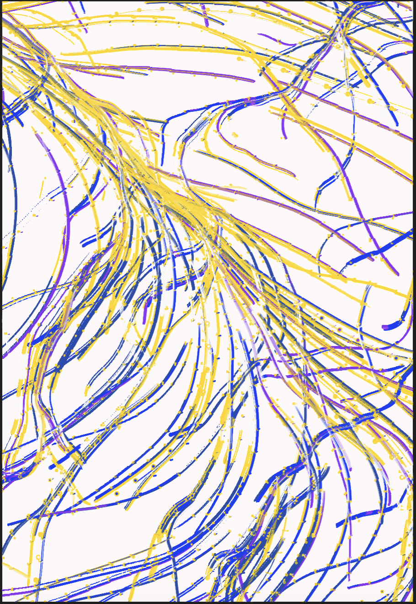

# The Scream
## by Joyce Yip ( jyip0315) 

### *Instructions:*
1.	**Move mouse curser slowly over the canvas from left to right** to paint repeated circles behind the character. 
As the mouse moves hues of blue change (left) into hues of yellow (right), creating a multi coloured effect. 
2.	**Click the buttons** to view different expressions.
3.	**Press a, s, d, and f  keys on the keyboard** to activate the buttons. Hold f key to see the mouth jitter.
This offers two options of input.

------------

### *My Approach to animating the group code:*

My individual approach to the group artwork focuses on user interaction through both mouse and keyboard input to make the experience more engaging. To reflect the chaotic background of The Scream, I drew visual inspiration from the artwork plant growing_test by cloud.cb found in the OpenProcessing platform, which uses a brush-like effect I admired. However, I adapted only the visual style, leaving out its lack of interactivity. Unlike my group members, I removed special effects from their elements to keep my version simpler and more focused.

plant growing_test by cloud.cb

I also changed the button labels "Levels 1–4" to keyboard keys “A”, “S”, “D”, and “F”. I originally planned to add a singing voice to each key to mimic a piano input, but decided against it to avoid overlapping with a teammate’s audio-based work. Instead, I animated the largest mouth to quiver, referencing the TikTok Pitch Perfect challenge to suggest a high-pitched scream. These changes in interaction and design distinguish my submission from the rest of the group.

 

YouTube short video link: https://www.youtube.com/shorts/84tQiELfF9Y  

------------
### *How it works*
